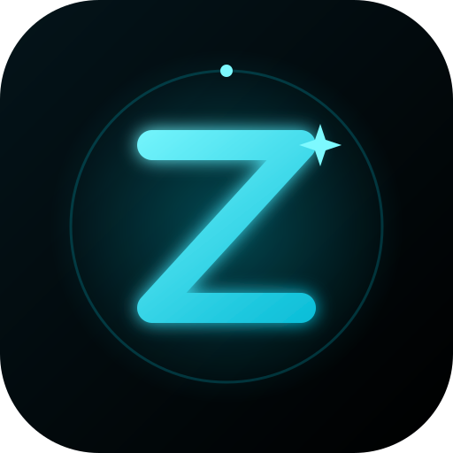

<div align="center">



# ZeoX

**Zoe Xavier — a companion who's always there.**

Black & cyan glow · streaming replies · built with Groq

`Node 18+` · `Express` · `Groq LPU™ Inference` · `Zero build step`

</div>

---

## What is ZeoX?

ZeoX is a real-time AI companion web app. On the surface it's a chat window —
under the hood it's a carefully engineered product:

| Layer | What it does |
|---|---|
| **Frontend** | Vanilla JS single page. Streaming UI, conversation memory, timestamps, welcome experience. No frameworks, no build step. |
| **Backend** | Express server that keeps your Groq key private and streams model output to the browser over Server-Sent Events. |
| **Persona** | `persona.js` is Zoe's soul — her full backstory, personality and voice. Everything she is lives in one file. |

## Features

- ⚡ **Live streaming replies** — responses type out token by token, not wall-of-text
- 🧠 **Conversation memory** — chats persist locally between visits (last 60 exchanges)
- 🎨 **Signature identity** — custom ZeoX logo, favicon and design system
- 💬 **Human-feel pacing** — natural typing delays and indicator
- 📱 **Fully responsive** — from phones to desktop, safe-area aware
- 🔒 **Secure by design** — the API key never touches the browser
- 🚀 **Deploy-ready** — works on Render, Railway, Fly.io, any Node host

## Quick start

```bash
# 1. get a free Groq key → https://console.groq.com/keys

# 2. set it
export GROQ_API_KEY=gsk_your_key_here

# 3. run
npm install
npm start
```

Open **http://localhost:3000**. That's it.

### Configuration (all optional)

| Variable | Default | Purpose |
|---|---|---|
| `GROQ_API_KEY` | — | **Required.** Your Groq API key |
| `GROQ_MODEL` | `openai/gpt-oss-120b` | Any Groq-supported model |
| `PORT` | `3000` | Server port |

## Project structure

```
zeox/
├── index.html          → the page
├── style.css           → design system: glass, glow, motion
├── script.js           → streaming client, memory, composer
├── persona.js          → Zoe's soul — backstory + rules
├── server.js           → Express + Groq streaming proxy
├── public/
│   ├── logo.svg              → app icon
│   ├── logo-horizontal.svg   → full wordmark lockup
│   └── favicon.svg           → browser tab icon
├── render.yaml         → one-click Render deploy
└── package.json
```

## Deploying

### Render (recommended)

The repo includes `render.yaml`. Push, then create a **Blueprint** in Render —
it detects the config. Add `GROQ_API_KEY` in the dashboard's Environment settings.

### Anywhere else

Any host that runs Node 18 works. Build command: none. Start command: `npm start`.

> **Never** put the Groq key in frontend code. It lives server-side only —
> that's the whole point of `server.js`.

## Customizing Zoe

Everything about her voice, story and rules lives in **`persona.js`**.
Edit that one file and the entire product changes with her.

---

<div align="center">

**ZeoX** · built with care · powered by [Groq](https://groq.com)

</div>
